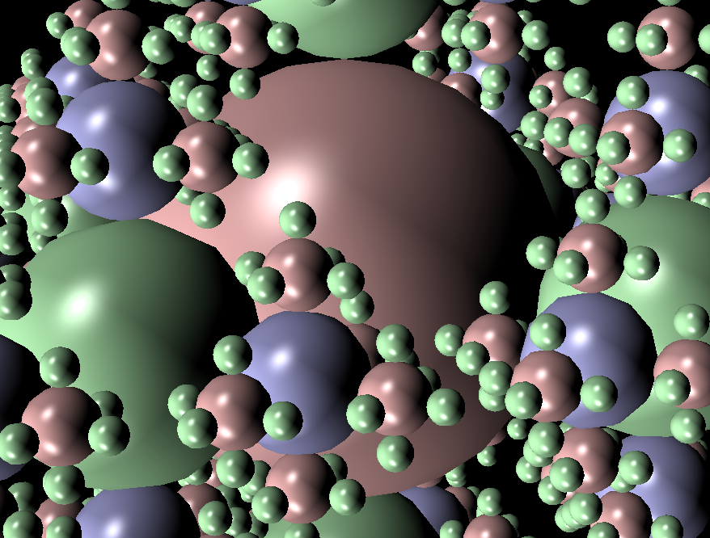

## Project 5: Lights, Camera

Please fill this out for Lights, Camera only. The project handout can be found [here](https://cs1230.graphics/projects/realtime/1).

### Output Comparison

Run the program, open the specified `.json` file, follow the instructions to set the parameters, and save the image with the specified file name using the "Save image" button in the UI. It should automatically suggest the correct directory - again, be sure to follow the instructions in the left column to set the file name. Once you save the images, they will appear in the table below.

> If your program can't find certain files or you aren't seeing your output images appear, make sure to:<br/>
>
> 1. Set your working directory to the project directory
> 2. Clone the `scenefiles` submodule. If you forgot to do this when initially cloning this repository, run `git submodule update --init --recursive` in the project directory

> Note: once all images are filled in, the images will be the same size in the expected and student outputs.

|                                           File/Method To Produce Output                                            |                                                     Expected Output                                                     |                                                                     Your Output                                                                     |
| :----------------------------------------------------------------------------------------------------------------: | :---------------------------------------------------------------------------------------------------------------------: | :-------------------------------------------------------------------------------------------------------------------------------------------------: |
|                Input: `unit_cone.json`<br/>Output: `unit_cone.png`<br/>Parameters: (5, 5, 0.1, 100)                |            |                        |
|            Input: `unit_cone_cap.json`<br/>Output: `unit_cone_cap.png`<br/>Parameters: (5, 5, 0.1, 100)            |        |                |
|               Input: `unit_cube.json`<br/>Output: `unit_cube.png`<br/> Parameters: (5, 5, 0.1, 100)                |            |                        |
|            Input: `unit_cylinder.json`<br/>Output: `unit_cylinder.png`<br/>Parameters: (5, 5, 0.1, 100)            |        |                |
|              Input: `unit_sphere.json`<br/>Output: `unit_sphere.png`<br/>Parameters: (5, 5, 0.1, 100)              |          |                    |
|          Input: `unit_cone.json`<br/>Output: `unit_cone_min.png`<br/>Parameters: (**1**, **3**, 0.1, 100)          |            |                |
|      Input: `unit_cone_cap.json`<br/>Output: `unit_cone_cap_min.png`<br/>Parameters: (**1**, **3**, 0.1, 100)      |        |        |
|          Input: `unit_cube.json`<br/>Output: `unit_cube_min.png`<br/>Parameters: (**1**, **1**, 0.1, 100)          |            |                |
|      Input: `unit_cylinder.json`<br/>Output: `unit_cylinder_min.png`<br/>Parameters: (**1**, **3**, 0.1, 100)      |        |        |
|        Input: `unit_sphere.json`<br/>Output: `unit_sphere_min.png`<br/>Parameters: (**2**, **3**, 0.1, 100)        |          |            |
|           Input: `parse_matrix.json`<br/>Output: `parse_matrix.png`<br/>Parameters: (**3**, 5, 0.1, 100)           |         |                  |
|            Input: `ambient_total.json`<br/>Output: `ambient_total.png`<br/>Parameters: (5, 5, 0.1, 100)            |        |                |
|            Input: `diffuse_total.json`<br/>Output: `diffuse_total.png`<br/>Parameters: (5, 5, 0.1, 100)            |        |                |
|           Input: `specular_total.json`<br/>Output: `specular_total.png`<br/>Parameters: (5, 5, 0.1, 100)           |       |              |
|              Input: `phong_total.json`<br/>Output: `phong_total.png`<br/>Parameters: (5, 5, 0.1, 100)              |          |                    |
|      Input: `directional_light_1.json`<br/>Output: `directional_light_1.png`<br/>Parameters: (5, 5, 0.1, 100)      |  |    |
| Input: `directional_light_2.json`<br/>Output: `directional_light_2.png`<br/>Parameters: (**10**, **10**, 0.1, 100) |  |    |
|      Input: `phong_total.json`<br/>Output: `phong_total_near_far.png`<br/>Parameters: (5, 5, **9.5**, **12**)      |  |  |
|      Input: `directional_light_1.json`<br/>Output: `directional_light_1_near_far.png`<br/>Parameters: (**25**, **25**, **8**, **10**)      |  |  |

### Design Choices

- **Camera data:** Calculation of view matrix and projection matrix is implemented in ```render/camera.cpp```
- **Shape implementations:** Shape implementations are in ```shapes/```. The implementation has been run in lab 8 to validate the correctness of discretization and normal calculation.
- **Shaders:** Shaders implementation and variable passing are implemented. One design choice to note is that only initializations are put in ```initializeGL()``` and value passing and updates are put in ```sceneChanged()```, to enable correct updating of scenefiles.
- **Tessellation:** Shape discretization changes with parameter toggles in all situations (including in adaptive level of detail).
- **Software engineering, efficiency, & stability:** 
  - Repeatable codes are packed into functions. 
  - When updating scenes or parameters, only necessary changes are computed.
  - When changing scenes, clean ip functions are called to clear scene objects.
  - The program can quickly render complex scenes like ```recursive_sphere_7.json```

### Collaboration/References

I clarify that there is no collaboration include when I do this project.

### Known Bugs

Currently there are no known bugs.

### Extra Credit

#### Adaptive level of detail

- **Number of objects in the scene**

When number of objects is in the scene is more than 10, the discretization level would be scaled by factor ```1.0 / (log(0.1 * (renderScene.sceneMetaData.shapes.size() - 10) + 1) + 1)``` to have smooth decreasing when the descretization level when the number of objects in the scene is changing.

Note that the lower bound 10 can be changed and the scaling factor function can also be changed to ```1.0 / (log(0.1 * (renderScene.sceneMetaData.shapes.size() - lower_bound) + 1) + 1)```. In addition, there is a commented out fixed factor 0.5 if user need to use this simplified version.

| File/Method To Produce Output |                                                     Whole Image | Zoom In |
| :----------------------------------------------------------------------------------------------------------------: | :---------------------------------------------------------------------------------------------------------------------: | :-------------------------------------------------------------------------------------------------------------------------------------------------: |
| Input: `recursive_sphere_2.json`<br/>Output: `recursive_sphere_2.png`<br/>Parameters: (25, 25, 0.1, 100)|            |     |
| Input: `recursive_sphere_3.json`<br/>Output: `recursive_sphere_3.png`<br/>Parameters: (25, 25, 0.1, 100)|            |     |
| Input: `recursive_sphere_4.json`<br/>Output: `recursive_sphere_4.png`<br/>Parameters: (25, 25, 0.1, 100)|            |     |
| Input: `recursive_sphere_5.json`<br/>Output: `recursive_sphere_5.png`<br/>Parameters: (25, 25, 0.1, 100)|            |     |
| Input: `recursive_sphere_6.json`<br/>Output: `recursive_sphere_6.png`<br/>Parameters: (25, 25, 0.1, 100)|            |     |
| Input: `recursive_sphere_7.json`<br/>Output: `recursive_sphere_7.png`<br/>Parameters: (25, 25, 0.1, 100)|            |     |
| Input: `recursive_sphere_8.json`<br/>Output: `recursive_sphere_8.png`<br/>Parameters: (25, 25, 0.1, 100)|            |     |


- **Distance from the object to the camera**

The discretization parameters are scaled by ```calculateDistanceFactors()```, in which the minimum distance ```minDistance``` of all the shapes in a scene is calculated and the discretization parameters for all other primitives are scaled by ```1 / (distance / minDistance)```. Note that after the scaling, the lower bound of discretization parameters is checked to ensure that the distant primitives have reasonable shapes.

The table below shows the comparison of ```extra_credit2``` turned off and on. When turned on, more distant spheres show fewer discretizations than nearer ones. When turned off, they have the same discretization levels.

| File/Method To Produce Output |                                                     Tunred off | Tunred on |
| :----------------------------------------------------------------------------------------------------------------: | :---------------------------------------------------------------------------------------------------------------------: | :-------------------------------------------------------------------------------------------------------------------------------------------------: |
| Input: `recursive_sphere_5.json`<br/>Output: `recursive_sphere_5.png`<br/>Parameters: (25, 25, 0.1, 100)|            |     |

#### Custom Scene File

This custom scene file resembles a robot car with sensors like eyes.

|                                           File/Method To Produce Output                                            |                                                                                                             Your Output                                                                     |
| :----------------------------------------------------------------------------------------------------------------: |:-------------------------------------------------------------------------------------------------------------------------------------------------: |
|Input: `custom_scene_file.json`<br/>Output: `custom_scene_file.png`<br/>Parameters: (25, 25, 0.1,100) |             |

#### Mesh Rendering

- Implemented my own .obj file reader from scratch.
- Can handle .obj files that explicitly specifies ```vn``` info (e.g., the ```dragon_mesh.obj```) and files that doesn't explicitly provide them (e.g., the ```bunny_mesh.obj```). In the later situation, the .obj reader function automatically calculates the vertex normals.

|                                           File/Method To Produce Output                                            |                                                                                                             Your Output                                                                     |
| :----------------------------------------------------------------------------------------------------------------: |:-------------------------------------------------------------------------------------------------------------------------------------------------: |
|Input: `bunny_mesh.json`<br/>Output: `bunny_mesh.png`<br/>Parameters: (5, 5, 0.1,100) |             |
|Input: `dragon_mesh.json`<br/>Output: `dragon_mesh.png`<br/>Parameters: (5, 5, 0.1,100) |             |
